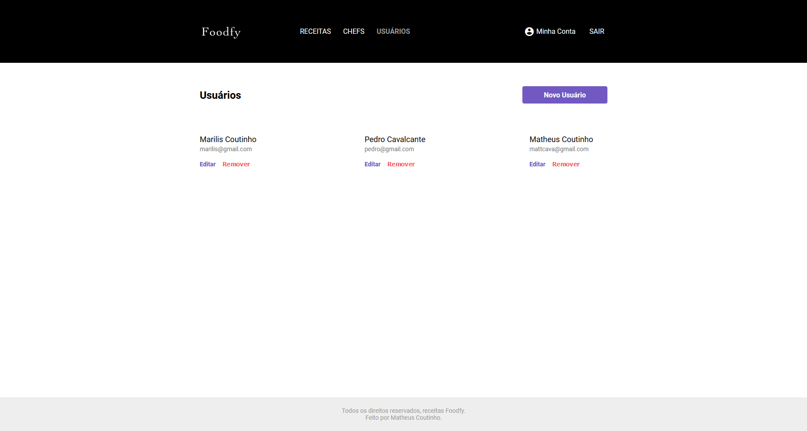

<h1 align="center">
    
</h1>

<h3 align="center" >
  A pretty recipes management website
</h3>

  
  
  
  
  

## :computer: Technologies

- [JavaScript](https://www.javascript.com)
- [HTML](https://www.w3.org)
- [CSS](https://www.w3.org/Style/CSS/Overview.en.html)
- [NodeJS](https://nodejs.org)
- [PostgreSQL](https://www.postgresql.org/)
- [Express](https://expressjs.com/)
- [Nodemailer](https://nodemailer.com/about/)

## Preview

<h1 align="center">
    
    
    
    
    
    
    
</h1>

## :memo: License

This project is under MIT. See at here [LICENSE](/LICENSE) for more informations.

---

Made by [Matheus Coutinho](https://github.com/mcoutinho88)
